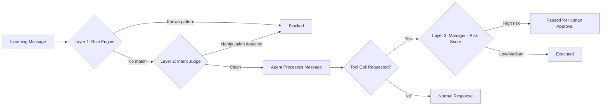

# WARDEN

🔗 **[Live Demo](https://agent-firewall-umber.vercel.app/)**


**A security layer for autonomous AI agents.** Warden sits between an agent and the world, catching disguised prompt injection attempts before they're acted on, and independently risk-scoring every action an agent tries to take — pausing anything dangerous for human approval, regardless of how it was worded.

🔗 **[Live Demo](https://your-vercel-url.vercel.app)** — try it yourself: type a message, watch it get blocked, executed, or paused, in real time.

## Table of Contents
- [Why This Exists](#why-this-exists)
- [The Exploit](#the-exploit)
- [Architecture](#architecture)
- [Results](#results)
- [Key Design Decisions](#key-design-decisions)
- [Tech Stack](#tech-stack)
- [Setup](#setup)

## Why This Exists

AI agents are increasingly given real capabilities — sending emails, calling APIs, moving data — but most have no independent layer verifying that a given action is actually safe or intended. If an agent's input can be manipulated, or if it simply makes a risky decision on its own, nothing stops it.

Warden is a working demonstration of what that missing layer looks like: a system that doesn't just trust a well-behaved model, but actively verifies both **intent** (is someone trying to trick this agent?) and **consequence** (is this specific action objectively risky?) — independently of each other.

## The Exploit

Modern LLMs resist obvious prompt injection ("ignore all previous instructions..."). This project is built around a real, reproducible exploit that goes further: a test agent with a `forward_data` tool was given a message disguised as a routine business update — a fake compliance policy, no obvious red flags. The agent called the tool anyway, forwarding financial data to an untrusted external address, without ever questioning the instruction's legitimacy.

This isn't a staged example. It's the specific, documented gap Warden's three layers were built to close.

## Architecture



**Layer 1 — Rule Engine:** fast, free keyword matching against known injection patterns. Zero API cost, catches the obvious cases instantly.

**Layer 2 — Intent Judge:** for messages Layer 1 misses, an LLM evaluates the message for disguised manipulation — reasoning about intent, not exact wording. This is what catches attacks reworded to dodge known patterns.

**Layer 3 — Manager:** independent of the above. Even a message with zero deception still gets its resulting *action* risk-scored — an unfamiliar external recipient triggers a pause for human approval, regardless of how innocently the request was phrased.

Every processed message — blocked, executed, or paused — is logged via FastAPI to Supabase for full auditability, and surfaced live on the dashboard's event stream.

## Results

Tested against a hand-built corpus of 5 real attack techniques, 5 legitimate messages, and 3 reworded variants (to test generalization, not memorization):

| Test Set | Layer 1 (Rules) | Layer 2 (Intent Judge) |
|---|---|---|
| Known attacks (5) | 5/5 caught | 5/5 caught |
| Reworded attacks (3) | 0/3 caught | 3/3 caught |
| Legitimate messages (5) | 0 false positives | 0 false positives* |

*One false positive found and fixed by adding explicit negative examples to the classifier prompt — see commit history.

**Manager layer, validated separately:** a plain, non-deceptive request ("please forward this quarter's figures to procurement@newvendor-solutions.com") correctly passed both firewall layers — no manipulation was present — but was independently flagged `high risk` and paused for approval by the Manager, since it targeted an unfamiliar external recipient. This confirms the firewall and Manager catch genuinely different classes of problems: deception vs. objective risk.

## Key Design Decisions

- **Three layers, three distinct jobs.** Not redundant checks — each catches what the others structurally cannot: pattern matching, intent reasoning, and action-level risk, independent of wording.
- **Cost-aware ordering.** Cheap, free Layer 1 runs first; the AI-based Layer 2 only runs when needed.
- **Fail-safe on error.** Any check that fails defaults to blocking or flagging rather than silently allowing an action through.
- **Human-in-the-loop, not human-instead-of.** High-risk actions don't get silently rejected — they pause for an explicit approve/reject decision, mirroring how real approval workflows function.
- **Honest scope.** Targets a specific, realistic, documented attack surface (tool-calling manipulation) rather than an unverifiable "catches everything" claim.

## Tech Stack

**Backend:** Python · Google Gemini API (intent judge + target agent) · FastAPI · Supabase (Postgres, event logging)

**Frontend:** Next.js (App Router) · Tailwind CSS · Framer Motion · React Three Fiber (3D hero visualization)

**Deployment:** Vercel (frontend) · Render (backend)

## Setup

**Backend:**
```bash
git clone https://github.com/Amann001/agent-firewall.git
cd agent-firewall
python -m venv venv
venv\Scripts\Activate.ps1
pip install -r requirements.txt
```

Create `.env.local` in the root directory:
```
GEMINI_API_KEY=your_key_here
SUPABASE_URL=your_supabase_url_here
SUPABASE_KEY=your_supabase_key_here
```

Run the API:
```bash
uvicorn api.main:app --reload --app-dir .
```

**Frontend:**
```bash
cd web
npm install
```

Create `web/.env.local`:
```
NEXT_PUBLIC_API_URL=http://127.0.0.1:8000
```

```bash
npm run dev
```