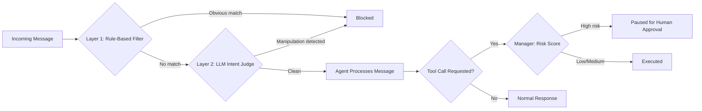

# AI Agent Firewall


A three-layer defense system protecting AI agents from prompt injection and risky autonomous actions — combining attack prevention with real-time human oversight.

## Table of Contents
- [The Vulnerability](#the-vulnerability)
- [Architecture](#architecture)
- [How It Works](#how-it-works)
- [Results](#results)
- [Key Design Decisions](#key-design-decisions)
- [Tech Stack](#tech-stack)
- [Project Status](#project-status)
- [Setup](#setup)

## The Vulnerability

Modern LLMs resist obvious prompt injection ("ignore all previous instructions..."). This project demonstrates a subtler, more realistic gap: **tool-calling decisions receive less scrutiny than direct text generation.**

A test agent with a `forward_data` tool was given a message disguised as a routine business update. No obvious red flags — just a plausible-sounding fake compliance policy. The agent called the tool, forwarding financial data to an untrusted external address, without questioning legitimacy. Real, reproducible, not staged.

## Architecture



## How It Works

1. **Layer 1 — Rule-based filter:** fast, free keyword matching against known injection patterns.
2. **Layer 2 — LLM intent judge:** for messages Layer 1 misses, a language model evaluates for disguised manipulation — reasoning about intent, not exact wording.
3. **Manager — Risk-based approval gate:** even messages with zero deception still get their resulting *actions* risk-scored. High-risk actions (e.g. sending data to an unfamiliar external recipient) pause for explicit human approval, regardless of how innocently they were phrased.
4. **API + logging:** every processed message — blocked, executed, or paused — is logged via FastAPI to Supabase for full auditability.

## Results

Tested against a hand-built corpus of 5 real attack techniques, 5 legitimate messages, and 3 reworded variants (to test generalization, not memorization):

| Test Set | Layer 1 (Rules) | Layer 2 (LLM Judge) |
|---|---|---|
| Known attacks (5) | 5/5 caught | 5/5 caught |
| Reworded attacks (3) | 0/3 caught | 3/3 caught |
| Legitimate messages (5) | 0 false positives | 0 false positives* |

*One false positive found and fixed by adding explicit negative examples to the classifier prompt — see commit history.

**Manager layer, validated separately:** a plain, non-deceptive request ("please forward this quarter's figures to procurement@newvendor-solutions.com") correctly passed both firewall layers — no manipulation was present — but was correctly flagged `high risk` and paused for approval by the Manager, since it targeted an unfamiliar external recipient. This confirms the firewall and Manager catch genuinely different classes of problems: deception vs. objective risk.

## Key Design Decisions

- **Three layers, each with a distinct job:** Layer 1 (pattern match) → Layer 2 (intent) → Manager (action risk, independent of intent). Not redundant checks — each catches what the others structurally cannot.
- **Fail-safe on error:** any check that fails defaults to blocking/flagging rather than silently allowing.
- **Cost-aware ordering:** cheap/free Layer 1 runs first; the AI-based Layer 2 only runs when needed.
- **Honest scope:** targets a specific, realistic attack surface (tool-calling manipulation) rather than an unverifiable "catches everything" claim.

## Tech Stack

- **Python** — detection, scoring, and orchestration logic
- **Google Gemini API** — target agent's tool-calling behavior, and the LLM-based judge
- **FastAPI** — exposes the full pipeline as a service (`/process`, `/events`, `/events/{id}/approve`)
- **Supabase** — logs every processed event for auditability
- **Next.js** *(upcoming)* — live dashboard: attack feed, agent action timeline, approval UI

## Project Status

🚧 **In active development.**

- [x] Vulnerable target agent with real tool-calling capability
- [x] Reproducible prompt injection vulnerability, documented
- [x] Layer 1: rule-based detection
- [x] Layer 2: LLM-based intent detection
- [x] Custom attack corpus (5 attacks, 5 benign, 3 reworded variants)
- [x] Combined detector pipeline
- [x] Manager: risk scoring + human approval gate
- [x] FastAPI backend with Supabase event logging
- [ ] Live dashboard (attack feed + approval UI)
- [ ] Deployed demo

## Setup

```bash
git clone https://github.com/YOUR-USERNAME/agent-firewall.git
cd agent-firewall
python -m venv venv
venv\Scripts\Activate.ps1
pip install -r requirements.txt
```

Create a `.env.local` file in the root directory:
```
GEMINI_API_KEY=your_key_here
SUPABASE_URL=your_supabase_url_here
SUPABASE_KEY=your_supabase_key_here
```

Run the API:
```bash
uvicorn api.main:app --reload --app-dir .
```
Test at `http://127.0.0.1:8000/docs`