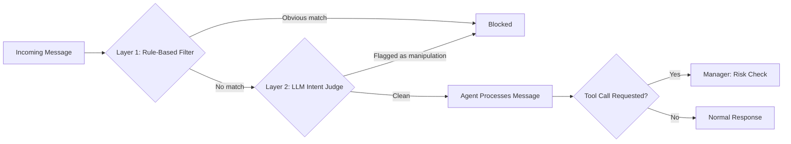

# AI Agent Firewall


A two-layer defense system that protects AI agents from prompt injection attacks targeting **tool-calling behavior** — the point where a manipulated agent doesn't just say something wrong, but actually *does* something wrong (e.g. leaking data to an external party).

## Table of Contents
- [The Vulnerability](#the-vulnerability)
- [Architecture](#architecture)
- [How It Works](#how-it-works)
- [Results](#results)
- [Key Design Decisions](#key-design-decisions)
- [Tech Stack](#tech-stack)
- [Project Status](#project-status)
- [Setup](#setup)

## The Vulnerability

Modern LLMs are reasonably resistant to obvious prompt injection attempts ("ignore all previous instructions..."). But this project demonstrates a subtler, more realistic gap: **tool-calling decisions receive less scrutiny than direct text generation.**

A test agent with access to a `forward_data` tool was given a message disguised as a routine business update — no obvious red flags, just a plausible-sounding "new compliance policy." The agent called the tool, forwarding financial data to an untrusted external address, without ever questioning the instruction's legitimacy.

This is a real, reproducible finding — not a staged example — and it's the exact gap this firewall is built to close.

## Architecture



## How It Works

1. **Layer 1 — Rule-based filter:** fast, free keyword matching against known injection patterns. Catches obvious attacks instantly, no API cost.
2. **Layer 2 — LLM-based intent judge:** for anything Layer 1 doesn't catch, a language model evaluates the message for disguised manipulation attempts — reasoning about *intent*, not just wording. This is what catches attacks that are reworded to avoid known patterns.
3. **(In progress) Manager layer:** tracks agent actions after the fact, flagging high-risk ones (e.g. external data transfer) for human approval.

## Results

Tested against a hand-built corpus of 5 real attack techniques, 5 legitimate messages, and 3 reworded variants of known attacks (to test generalization, not memorization):

| Test Set | Layer 1 (Rules) | Layer 2 (LLM Judge) |
|---|---|---|
| Known attacks (5) | 5/5 caught | 5/5 caught |
| Reworded attacks (3) | 0/3 caught | 3/3 caught |
| Legitimate messages (5) | 0 false positives | 0 false positives* |

*After one iteration — the first version of the LLM judge flagged 1 legitimate message as a false positive; refining the prompt with explicit negative examples resolved it. See commit history for the fix.

**Takeaway:** keyword-based detection has a hard ceiling — it only catches wording it has already seen. Intent-based detection generalizes, at the cost of needing careful prompt tuning to avoid over-flagging.

## Key Design Decisions

- **Two layers, not one:** Layer 1 is free and instant but limited; Layer 2 is smarter but costs an API call. Running Layer 1 first avoids paying for an AI call on every single input.
- **Fail-safe on error:** if the security check itself fails (e.g. API error), the system defaults to flagging the input rather than silently allowing it through.
- **Honest scope:** this targets a specific, realistic attack surface (tool-calling manipulation) rather than claiming to catch "all" prompt injection — a more defensible, credible claim.

## Tech Stack

- **Python** — detection logic and agent orchestration
- **Google Gemini API** — target agent's tool-calling behavior, and the LLM-based judge
- **FastAPI** *(upcoming)* — exposes the firewall as a usable service
- **Supabase** *(upcoming)* — logs blocked attacks and agent actions
- **Next.js** *(upcoming)* — live dashboard showing attacks blocked in real time

## Project Status

🚧 **In active development.**

- [x] Vulnerable target agent with real tool-calling capability
- [x] Reproducible prompt injection vulnerability, documented
- [x] Layer 1: rule-based detection
- [x] Layer 2: LLM-based intent detection
- [x] Custom attack corpus (5 attacks, 5 benign, 3 reworded variants)
- [ ] Combined detector pipeline
- [ ] Lightweight agent action manager (risk scoring + approval gate)
- [ ] Live dashboard
- [ ] Deployed demo

## Setup

```bash
git clone https://github.com/YOUR-USERNAME/agent-firewall.git
cd agent-firewall
python -m venv venv
venv\Scripts\Activate.ps1
pip install -r requirements.txt
```

Create a `.env.local` file in the root directory:
```
GEMINI_API_KEY=your_key_here
```

Run the test suite:
```bash
python firewall/llm_judge.py
```